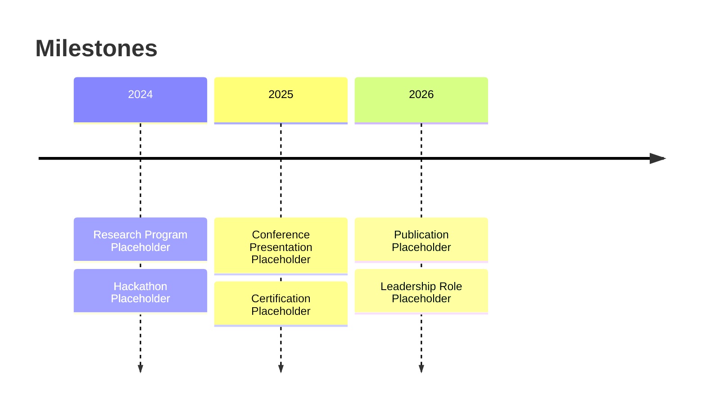

<!-- ============================================================ -->
<!--  HERO SECTION                                                 -->
<!-- ============================================================ -->

 

# 🩺 Ammara Tariq

### *Doctor of Physiotherapy in Training · Healthcare AI Researcher*

 

<!-- Animated typing banner — edit &lines= to update the cycling roles -->

 

 

---

## 👋 Introduction

<table>
<tr>
<td>

I'm a **medical student and healthcare AI researcher** working at the intersection of **medicine, artificial intelligence, and clinical research**. My focus is on applying machine learning to **medical imaging** and **oncology**, with an emphasis on **reproducible, evidence-based research** that can meaningfully support patient care.

I'm especially interested in **brain tumor detection**, **precision medicine**, and building AI systems that are transparent and clinically trustworthy.

</td>
</tr>
</table>

 

---

## 🧬 About Me

<table>
<tr>
<td align="center" width="25%">

🩺
**Medical Student**
Training in clinical medicine

</td>
<td align="center" width="25%">

🧠
**Healthcare AI Researcher**
AI applied to clinical problems

</td>
<td align="center" width="25%">

🩻
**Medical Imaging**
MRI-based diagnostic research

</td>
<td align="center" width="25%">

🧬
**Oncology & Neuroscience**
Brain tumor research focus

</td>
</tr>
<tr>
<td align="center" width="25%">

🔬
**Clinical Research**
Study design & data analysis

</td>
<td align="center" width="25%">

🤖
**Machine Learning**
Deep learning for diagnostics

</td>
<td align="center" width="25%">

📖
**Research Leadership**
Coordinating research teams

</td>
<td align="center" width="25%">

🌍
**Open Science**
Open-source & collaboration

</td>
</tr>
</table>

 

---

## ⭐ Professional Highlights

 

---

## 🔬 Research Areas

<table>
<tr>
<td width="20%" align="center">🧠 <b>Brain Tumor Detection</b> MRI-based deep learning detection models</td>
<td width="20%" align="center">🩻 <b>Medical Imaging</b> MRI / CT analysis & preprocessing</td>
<td width="20%" align="center">🤖 <b>Healthcare AI</b> Applied ML for clinical decision support</td>
<td width="20%" align="center">🧬 <b>Oncology</b> Cancer detection & progression research</td>
<td width="20%" align="center">🔬 <b>Neuroscience</b> Brain structure & pathology research</td>
</tr>
<tr>
<td width="20%" align="center">📊 <b>Clinical Data Science</b> Structured clinical data analysis</td>
<td width="20%" align="center">💻 <b>Machine Learning</b> Model design & evaluation</td>
<td width="20%" align="center">🧪 <b>Deep Learning</b> CNNs & transfer learning for imaging</td>
<td width="20%" align="center">📚 <b>Literature Review</b> Systematic evidence synthesis</td>
<td width="20%" align="center">🏥 <b>Precision Medicine</b> Personalized, data-driven care</td>
</tr>
</table>

 

---

## 📊 Current Research Dashboard

<!-- Update these values as your work progresses -->

| Project | Focus | Progress |
|---|---|---|
| 🧠 AI-Assisted Brain Tumor Detection | Deep learning on MRI scans |  |
| 🩻 Medical Imaging Pipeline | Preprocessing & augmentation |  |
| 🤝 Research Collaboration | Multi-institution coordination |  |
| 📚 Literature Review | Ongoing systematic review |  |
| 🤖 Deep Learning Models | Model design & training |  |
| 📈 Model Evaluation | Metrics & explainability |  |
| 📝 Research Documentation | Manuscript & report writing |  |

 

---

## 🛠 Tech Stack

**Programming**

**AI & Machine Learning**

**Development**

**Research**

 

---

## 📈 GitHub Analytics

 

 

  

 

---

## 🚀 Featured Research Projects

<table>
<tr>
<td width="50%" valign="top">

### 🧠 NeuroVision AI
AI-assisted brain tumor detection framework using deep learning on MRI images, built for research reproducibility and clinical explainability.

`Python` `PyTorch` `OpenCV` `Deep Learning`

</td>
<td width="50%" valign="top">

### 🩻 Medical Imaging Toolkit
A preprocessing and analysis toolkit for MRI/CT scans, including normalization, augmentation, and visualization utilities.

`Python` `NumPy` `scikit-image`

</td>
</tr>
<tr>
<td width="50%" valign="top">

### 📊 Clinical Data Research Hub
A structured hub for clinical dataset analysis, statistical modeling, and reproducible research workflows.

`Python` `Pandas` `R`

</td>
<td width="50%" valign="top">

### 🤝 AI Research Collaborations
A collection of collaborative AI-in-medicine research projects with academic and open-source partners.

`Research` `AI` `Healthcare`

</td>
</tr>
</table>

 

---

## 🏆 Achievements

<!-- Fill in real entries below as they occur -->

<strong>📄 Publications</strong>

- *Placeholder — add publication title, venue, and year*

<strong>🎤 Conferences & Interviews</strong>

- *Placeholder — add conference/talk name and year*

<strong>🏅 Hackathons & Awards</strong>

- *Placeholder — add hackathon/award name and year*

<strong>🎓 Certifications</strong>

- *Placeholder — add certification name and issuer*

<strong>🧭 Leadership & Research Programs</strong>

- *Placeholder — add role, organization, and duration*

 

---

## 💬 Research Philosophy

> *"Medicine provides the questions. Artificial intelligence helps us discover better answers. My goal is to bridge both disciplines through responsible research that improves patient care."*

 

---

## 📫 Connect With Me

 

---

### 📊 Footer Stats

 

> *"The good physician treats the disease; the great physician treats the patient who has the disease."* — William Osler

 

*Building the future of healthcare, one experiment at a time.*

